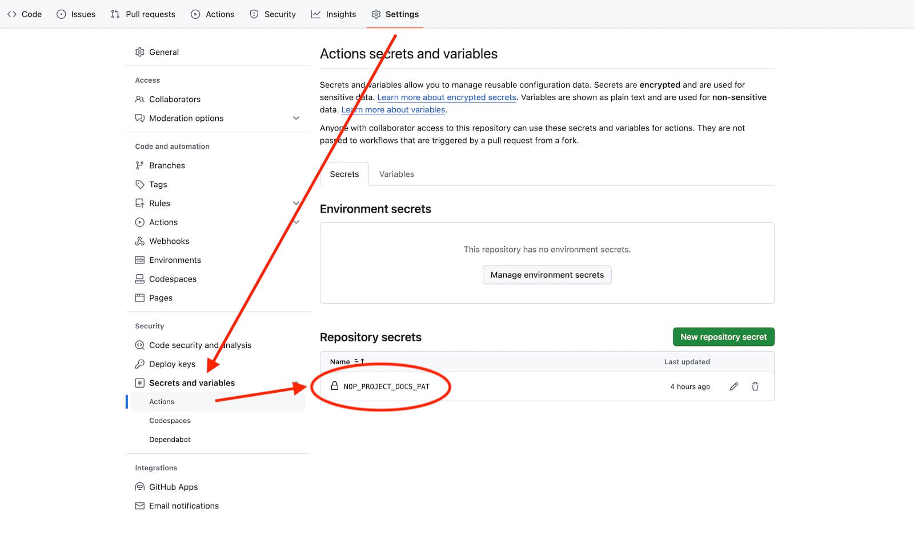

# 可复用工作流

本仓库 [`.github/workflows`](../.github/workflows) 中有几个文件是[可复用工作流](https://docs.github.com/en/actions/using-workflows/reusing-workflows)——

## 同步项目文档

`sync-project-docs.yml` 用于将社区项目的文档自动同步到[「`nop-platform`」组织](https://github.com/nop-platform)下的指定仓库中。

在社区项目的源仓库中创建一个 GitHub Actions 的工作流，内容大致为：

```yml
name: Sync Docs to Nop Community

on:
  push:
    branches:
      - main
    paths:
      - docs/*

jobs:
  sync-docs-to-community:
    uses: nop-platform/.github/.github/workflows/sync-project-docs.yml@main
    with:
      repo: nop-entropy-docs
    secrets:
      token: ${{ secrets.NOP_PROJECT_DOCS_PAT }}
```

支持参数（通过 `with` 传入）如下：

| 参数 | 作用 | 必填 | 默认值 |
| --- | --- | --- | --- |
| `repo` | 社区指定中转仓库名 | 是 |  |
| `source` | 社区项目源仓库中文档所在文件夹的相对路径（勿以 `./` 开头） | 否 | `docs` |

另外，`secrets.token` 也是必需的，它的值是至少拥有 `repo` 权限的 [Personal Access Tokens (Classic)](https://github.com/settings/tokens)，需要在源仓库的「Settings」中设置 `NOP_PROJECT_DOCS_PAT`：


